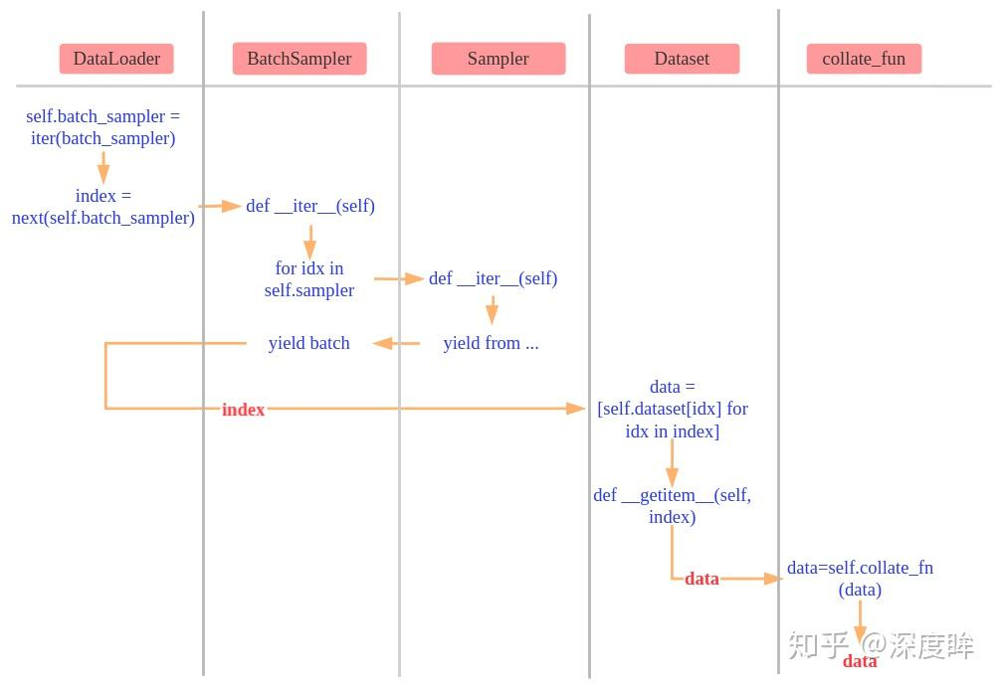

按照torch的风格，把Softmax和CELoss结合起来放到CrossEntropyLoss模块，也就是nn.CrossEntropyLoss() = nn.LogSoftmax() + nn.NLLLoss()

TODO: 

+ Linear添加控制是否使用bias参数
+ 理解Linear反向传播的过程（在docs.md中手写一遍）
+ 把Softmax和交叉熵等重要模块的求梯度补充在文档中，理解反向求导过程
+ 多分类为何使用CELoss而不使用MESLoss
+ 训练图片做标准化、归一化
+ 主程序换成jupyter notebook

## Section 1. 代码基本架构

代码架构上我积极参考了 PyTorch 的文档，实现了一个 torch-like 的深度学习框架，各个模块的接口都尽量向 torch 看齐，能比较方便地实现可伸缩易调整的网络结构：

+ `nn` 模块是框架核心部分，包含了 `Linear` 、`Sigmoid` 等基本网络结构的前后向传播逻辑。
+ `optim` 模块和训练优化器相关，包含了最基本的优化器 `Optimizer` 等。
+ `utils` 模块与训练数据加载有关，其中实现了 `DataLoader` 、`BatchSampler` 等。
+ `model` 模块是使用框架搭建的自定义模型，包含模型结构、训练逻辑、模型存取等。
+ `init` 模块中主要包含初始化时使用的函数，包括设置随机种子、日志设置、数据预处理等。

为了加速和方便计算表示，我使用了 `numpy` 库进行数学计算，并使用 `numpy.ndarray` 代替 `torch.Tensor` 进行向量化计算，使用 `numpy` 让性能不至于太低。

下面挑选代码中最重要的一些类进行分析，为节省字数，代码中所有的注释都被删去，具体注释详见源码。

### Linear

```python
class Linear(Module):
    def __init__(self, input_size, output_size):
        super(Linear, self).__init__()
        self.inputs = None
        self.params = {"weight": None, "bias": None}
        self.grads = {"weight": None, "bias": None}
        sqrt_k = np.sqrt(1 / input_size)
        self.params["weight"] = np.random.uniform(
            low=-sqrt_k, high=sqrt_k, size=(input_size, output_size)
        )
        self.params["bias"] = np.random.uniform(
            low=-sqrt_k, high=sqrt_k, size=(1, output_size)
        )

    def forward(self, inputs):
        self.inputs = inputs
        return np.matmul(self.inputs, self.params["weight"]) + self.params["bias"]

    def backward(self, grads):
        self.grads["weight"] = np.matmul(self.inputs.T, grads)
        self.grads["bias"] = np.sum(grads, axis=0)
        return np.matmul(grads, self.params["weight"].T)
```

线性层很大程度地参考了 PyTorch 文档的定义，但是矩阵计算采用 $y=xA+b$ 式（不同于文档提到的 $y=xA^{T}+b$ ），可以使用 `input_size` 和 `output_size` 指定每个 sample 的输入输出情况。在参数的初始化方面，参考 PyTorch 文档使用 $U(-\sqrt k, \sqrt k)$ ，其中 $k=\frac{1}{\text{input\_size}}$ 。

这样初始化也较符合 Project1 文档和老师上课的说法，将初始参数调得比较小，能比较好达到收敛。

### Softmax

考虑到 softmax 函数的计算过程需要在后续被复用，我把 softmax 的计算逻辑单独封装为 `softmax` 函数：

```python
def softmax(input, dim):
    exp_logits = np.exp(input - np.max(input, axis=dim, keepdims=True))
    softmax_scores = exp_logits / np.sum(exp_logits, axis=dim, keepdims=True)
    return softmax_scores
```

注意到这里的 softmax 计算其实先对每个 sample 减去了分量中的最大值，然后再计算 exp ，与课件上或 PyTorch 文档中的定义不同。这么做是为了避免因输入数值较大而出现上溢，而且这么做不会影响 softmax 计算的合理性，这点将在下一节证明。

所以 `Softmax` 的前向传播就是简单地直接调用 `softmax` ，反向传播利用保存下来的 `softmax_scores` ：

```python
class Softmax(Module):
    def __init__(self, dim):
        super(Softmax, self).__init__()
        self.dim = dim

    def forward(self, inputs):
        self.softmax_scores = softmax(inputs, dim=self.dim)
        return self.softmax_scores

    def backward(self, grads):
        sum = np.sum(grads * self.softmax_scores, axis=self.dim, keepdims=True)
        return self.softmax_scores * (grads - sum)
```

对 `ndarray` 使用 softmax 后，在指定维度上的分量将会在 $[0, 1)$ 范围内，并且这些分量和为 1 。

### CrossEntropyLoss

```python
class CrossEntropyLoss(Module):
    def __init__(self):
        super(CrossEntropyLoss, self).__init__()

    def forward(self, predicts, labels):
        self.predicts = predicts
        self.labels = labels
        self.batch_size = predicts.shape[0]

        self.softmax_scores = softmax(predicts, dim=1)

        if predicts.shape == labels.shape:
            loss = -np.sum(labels * np.log(self.softmax_scores))
        else:
            e = labels[0]
            if not (np.isscalar(e) and np.issubsctype(np.asarray(e), np.integer)):
                raise ValueError
            loss = -np.sum(np.log(self.softmax_scores[np.arange(self.batch_size), labels]))
        return loss / self.batch_size

    def backward(self):
        if self.predicts.shape == self.labels.shape:
            grads = self.softmax_scores - self.labels
        else:
            grads = self.softmax_scores.copy()
            grads[np.arange(self.batch_size), self.labels] -= 1
        return grads / self.batch_size
```

参考 PyTorch 文档，输入的每个 sample 不需要分量求和为 1 ，因为文档提到 `nn.CrossEntropyLoss` 等价于先计算 `nn.LogSoftmax` 然后计算 `nn.NLLLoss` ，也就是会先对输入进行 softmax ，然后再计算交叉熵损失函数。所以在多分类问题中，若使用 `CrossEntropyLoss` 作为损失函数，则模型的输出层实际无需再添加 `Softmax` 层。

同时，这里实现的 `CrossEntropyLoss` 也支持两种 `target` 形式，可以是形如 `(batch_size)` 的一维数组，存储每个 sample 的目标分类索引，也可以是形如 `(batch_size, class_num)` 的矩阵，存储每个 sample 的各个类的分类概率，例如 one-hot 编码。

对于 `labels`（也即 `target` ）是 `(batch_size)` 的一维数组时，代码中利用了 `numpy` 的高级索引—— `self.softmax_scores[np.arange(self.batch_size), labels]` 简化代码编写，提高计算效率。

### MSELoss

```python
class MSELoss(Module):
    def __init__(self):
        super(MSELoss, self).__init__()
        self.predicts = None
        self.labels = None
        self.batch_size = None

    def forward(self, predicts, labels):
        self.predicts = predicts
        self.labels = labels
        self.batch_size = predicts.shape[0]
        loss = np.square((predicts - labels)) / 2
        return np.sum(loss) / self.batch_size

    def backward(self):
        loss_grad_predicts = self.predicts - self.labels
        return loss_grad_predicts / self.batch_size
```

比较简单的均方误差损失函数，默认计算平均损失，但是和 PyTorch 文档中的 $l_n=(x_n-y_n)^2$ 不同，这里采用课件上的 $l_n=\frac{1}{2}(x_n-y_n)^2$ 式。

### Sigmoid

```python
class Sigmoid(Module):
    def __init__(self):
        super(Sigmoid, self).__init__()
        self.outputs = None

    def forward(self, inputs):
        self.outputs = 1.0 / (1.0 + np.exp(-inputs))
        return self.outputs

    def backward(self, grads):
        outputs_grad_inputs = np.multiply(self.outputs, (1.0 - self.outputs))
        return np.multiply(grads, outputs_grad_inputs)
```

简单的 `Sigmoid` 实现，也叫做 `Logistic` 函数，作为激活层，也是二分类常用的函数。

### ReLU

```python
class ReLU(Module):
    def __init__(self):
        super(ReLU, self).__init__()
        self.inputs = None

    def forward(self, inputs):
        self.inputs = inputs
        return np.maximum(0, inputs)

    def backward(self, grads):
        outputs_grad_inputs = self.inputs > 0
        return np.multiply(grads, outputs_grad_inputs)
```

除了课件上提到的 `Sigmoid` 模块，我还实现了 `ReLU` 激活函数，考虑到 `Sigmoid` 容易面临梯度消失的问题，所以实际代码中我更多使用 `ReLU` 。但是 `ReLU` 也可能导致神经元死亡，对应部分参数不更新，训练模型时需要谨慎调整超参。

### Optimizer

```python
class Optimizer:
    def __init__(self, model, lr):
        self.model = model
        self.lr = lr

    def step(self):
        for layer in self.model.module_list:
            if hasattr(layer, "params") and isinstance(layer.params, dict):
                for key in layer.params.keys():
                    layer.params[key] -= self.lr * layer.grads[key]

    def zero_grad(self):
        for layer in self.model.module_list:
            if hasattr(layer, "grads") and isinstance(layer.grads, dict):
                for key in layer.grads.keys():
                    layer.grads[key].fill(0.0)
```

按照 PyTorch 的文档，`Optimizer` 应当传入一个可迭代的 `params` 声明要被优化（调整）的模型权重，但是这又涉及到 torch 中的子模块注册机制，严格实现会增加很多意义不大的工作量。考虑到实验中只用到了类似 `ModuleList` 这样的结构，而且其中的子模块都是 `nn` 中的基本结构。故可以直接把整个 `model` 传入 `Optimizer` ，调整模型参数时直接遍历 `model.module_list` 即可。

`step()` 方法应在模型反向传播后调用，其遍历各个子模块的参数，根据学习率和各层的梯度进行参数调整。

`zero_grad()` 方法直接遍历各层模块并清零存储的梯度。

### DataLoader

为了方便训练代码的编写，我还实现了一个 `DataLoader` ，使用的方式和 torch 中的相近，能够根据 `Dataset` 和 `Sampler` 对给出的数据集进行采样、整合，并提供一种迭代的方式使用数据。

```python
class DataLoader:
    def __init__(
        self, dataset, batch_size=1, shuffle=False, collate_fn=None, drop_last=False
    ):
        sampler = RandomSampler(dataset) if shuffle else SequentialSampler(dataset)
        batch_sampler = BatchSampler(sampler, batch_size, drop_last)
        if collate_fn is None:
            collate_fn = default_collate

        self.dataset = dataset
        self.batch_size = batch_size
        self.drop_last = drop_last
        self.sampler = sampler
        self.batch_sampler = batch_sampler
        self.batch_sampler_iter = None
        self.collate_fn = collate_fn

    def __len__(self):
        return len(self.batch_sampler)

    def __next__(self):
        indices = next(self.batch_sampler_iter)
        data = [self.dataset[idx] for idx in indices]
        stacked = self.collate_fn(data)
        return stacked

    def __iter__(self):
        self.batch_sampler_iter = iter(self.batch_sampler)
        return self
```

为了更好地解释这部分代码，这里引用知乎上的一张流程图：



`BatchSampler` 是批量采样器，迭代这个批量采样器会每次返回一批的索引，我们利用这些索引从 `dataset` 中获取一批的 sample ，以一个 `list` 的形式传入 `collate_fun` 进行整理，整理后返回一个可以输入网络的 `ndarray` 。默认整理函数参考了 PyTorch 的源代码，利用递归可以处理 `ndarray` 、`dict` 、`list` 形式的 sample ：

```python
def default_collate(batch):
    elem_type = type(batch[0])
    if elem_type.__module__ == "numpy":
        return np.stack(batch, 0)
    elif isinstance(batch[0], collections.Mapping):
        return {key: default_collate([d[key] for d in batch]) for key in batch[0]}
    elif isinstance(batch[0], collections.Sequence):
        transposed = zip(*batch)
        return [default_collate(samples) for samples in transposed]
    else:
        raise NotImplementedError
```

`collate_fun` 把 $\text{batch\_size}$ 个形如  $(dim_0, dim_1, \cdots, dim_k)$ 的 `ndarray` sample 整理成一个形如 $(\text{batch\_size}, dim_0,\cdots,dim_k)$ 的 `ndarray` batch 。而 `Sampler` 提供对整个数据集所有样本的一个采样索引序列，每次 `BatchSampler` 从 `Sampler` 中取 $\text{batch\_size}$ 个索引，利用这些索引去 `dataset` 中取对应的 sample 。所以 `dataset` 只需要实现 `__getitem__` 和 `__len__` 方法即可。

### Others

在这里简单介绍一下

## Section 2. 对反向传播算法的理解


### Linear

线性层是代码中的核心模块，也是实验中神经网络的主要组成部分。


## Section 3. 


## 参考资料

+ [PyTorch documentation — PyTorch 2.1 documentation](https://pytorch.org/docs/stable/index.html)
+ [nndl/nndl.github.io: 《神经网络与深度学习》 邱锡鹏著 Neural Network and Deep Learning](https://github.com/nndl/nndl.github.io)
+ [温故知新——前向传播算法和反向传播算法（BP算法）及其推导 - 知乎 (zhihu.com)](https://zhuanlan.zhihu.com/p/71892752)
+ [带你从零掌握迭代器及构建最简 DataLoader - 知乎 (zhihu.com)](https://zhuanlan.zhihu.com/p/340465632)
+ [DataLoader原理解析 (最简单版本实现) - 知乎 (zhihu.com)](https://zhuanlan.zhihu.com/p/549850590)
+ [PyTorch36.DataLoader源代码剖析 - 知乎 (zhihu.com)](https://zhuanlan.zhihu.com/p/169497395)
